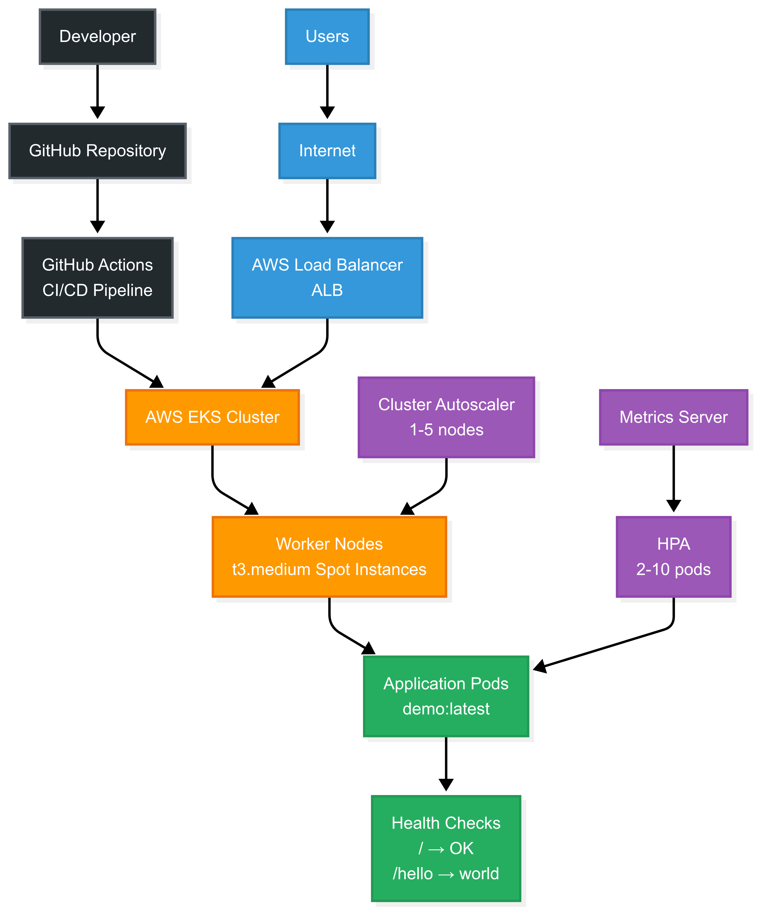

# EKS-Terraform-Helm Solution

A production-ready Kubernetes application deployment on AWS EKS with automated scaling and CI/CD using Terraform, Github actions and helm. This is a minimal solution which provides the foundation for the complete production system.

## Architecture



## Architecture Philosophy
I've designed this as a minimal viable solution that demonstrates enterprise-grade practices while maintaining simplicity for demonstration purposes. The architecture is intentionally modular and can be enhanced for production environments with additional components such as:

- **Advanced monitoring and observability (Prometheus, Grafana, ELK stack)
- **Enhanced security scanning and policy enforcement
- **Multi-environment promotion pipelines
- **Disaster recovery and backup strategies
  
# Technology Stack

- **Infrastructure: Terraform, AWS EKS, VPC, ALB**
- **Container Platform: Kubernetes, Docker**
- **Application Packaging: Helm**
- **CI/CD: GitHub Actions**
- **Monitoring: CloudWatch, Metrics Server**

## 💡 What's Included (Core Features)

### ✅ **Scalability**
- **Horizontal Pod Autoscaler**: Scales 2-10 replicas based on CPU
- **Cluster Autoscaler**: Scales nodes 1-5 automatically  
- **Multi-AZ deployment**: High availability across 2 zones

### ✅ **Monitoring** 
- **CloudWatch**: Built-in AWS monitoring
- **Kubernetes metrics-server**: For HPA functionality
- **Health checks**: Readiness and liveness probes

### ✅ **Cost Optimization**
- **Spot instances**: 50% cost savings
- **Right-sized instances**: t3.medium for cost efficiency
- **Auto-scaling**: Only pay for what you use

### ✅ **Ease of Use**
- **Automated CI/CD**: GitHub Actions deploys on commit to main
- **Professional ingress**: AWS ALB with proper load balancing
- **Helm packaging**: Standardized deployment
- **CLocal testing without AWS**: Script to test the solution in your local machine without AWS

### ✅ **Bonus Points Included:**
- **✅ Ingress configuration**: AWS Application Load Balancer with ALB Controller
- **✅ CI/CD pipeline**: Complete GitHub Actions workflow  
- **✅ Architecture design**: Multi-AZ, auto-scaling, spot instances

## Project Structure

```
├── terraform/           # Infrastructure as Code
│   ├── main.tf         # EKS cluster configuration
│   └── variables.tf    # Configuration variables
├── helm/demo-app/ # Kubernetes application
│   ├── values.yaml     # Application configuration
│   └── templates/      # K8s manifests
├── .github/workflows/  # CI/CD pipeline
└── test-local.sh      # Local testing script
```

## Quick Start

### Prerequisites

```bash
# Install required tools
brew install docker kind kubectl helm terraform awscli
```

### Testing in local machine

```bash
git clone https://github.com/nakulchandra92/EKS-Terraform-Helm
# Test locally with Kind
chmod +x test_local.sh
./test_local.sh

# Test health endpoints
curl http://localhost:8080/      # Returns "OK"
curl http://localhost:8080/hello # Returns "world"
```
```bash
#Test GitHub Actions Workflow:

brew install act

# Test the workflow (without actually deploying)
act -W .github/workflows/deploy.yaml -j validate -e pull_request.json

```


## Health Checks

The application provides the required endpoints:

- `GET /` → Returns `"OK"` (Readiness probe)
- `GET /hello` → Returns `"world"` (Liveness probe)

## Auto-Scaling

- **Horizontal Pod Autoscaler**: Scales pods 2-10 based on CPU (70% threshold)
- **Cluster Autoscaler**: Scales nodes 1-5 based on pod demand
- **Spot Instances**: t3.medium spot instances for cost optimization

## Monitoring

- **Kubernetes Metrics**: Metrics Server provides CPU/memory data for auto-scaling
- **Health Checks**: Automated readiness and liveness probe monitoring
- **Basic AWS Metrics**: EKS automatically sends basic cluster metrics to CloudWatch


